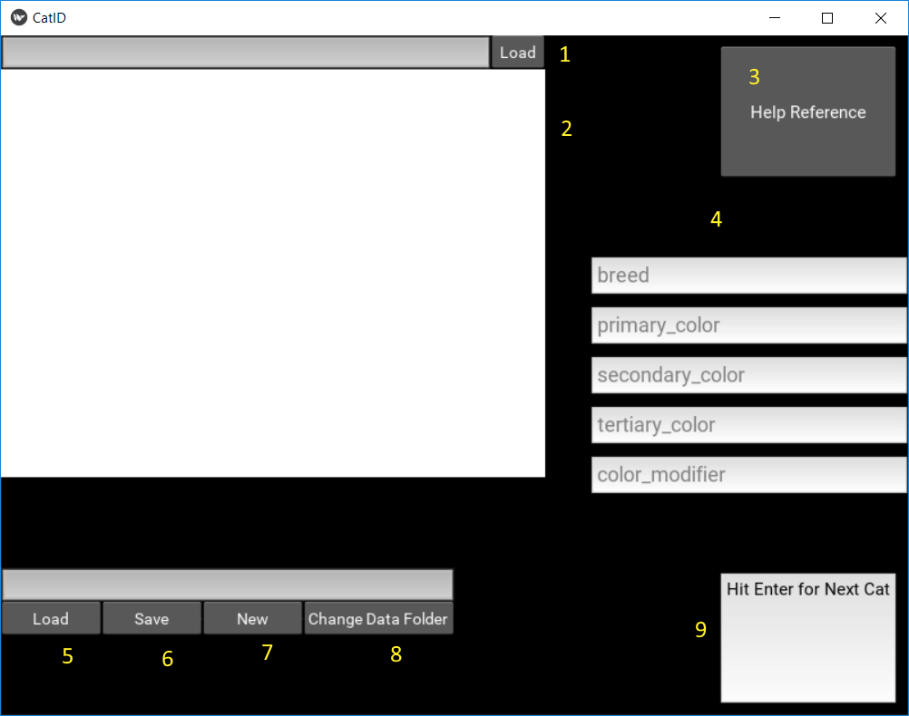

# Cat_Type_ID_Project
A desktop application designed to enable rapid data entry for cat attributes in scraped images. The app is designed using [Kivy](https://kivy.org/#home).

## Getting Started
You will need a few things on your system to get this working:

1. Python 3.5+
2. Kivy for Python
3. pandas 0.20.3+

### Python 3.5+
Many tutorials exist on installing Python, e.g. [Anaconda3](https://conda.io/docs/user-guide/install/download.html).

### Kivy
A comprehensive download and installation guide can be found [here](https://kivy.org/#download).

### pandas
This is part of the SciPy stack, which is included by default in your Anaconda3 distro if you chose to install it. Otherwise, grab the SciPy stack manually or install pandas using pip:
```
pip install pandas
```
A complete guide is given [here](https://pandas.pydata.org/pandas-docs/stable/install.html).


## Running the app:
Start the app using your python distribution:
```
python cat_id_io.py
```
You are presented with a GUI containing everything necessary to tag cat images:



1. Choose an image to load and begin tagging. Whether you are beginning or resuming a tagging session, any image in the source folder is a valid choice. Images are not double-tagged, although you will have to go through the motions of tagging the first image you choose.
2. The image to be tagged is shown here
3. This help reference opens a popup which describes the valid entries for each of the fields in part 4. 
4. In each field, enter the number or character which corresponds to the correct attribute for the cat in the image. Once you enter a single character, the focus automatically shifts to the next field. **Before proceeding to the field described in part 9 below, make sure you have a pandas DataFrame opened!** Once you reach the final field ("Hit enter for next cat!"), just hit enter for the next cat and you'll be refocused to the first field.
5. This button will let you choose a previously saved pandas DataFrame to resume cat image tagging.
6. Lets you save the current DataFrame.
7. Opens a new DataFrame for tagging (There is no feedback indicating that this has happened).
8. This button is for transporting DataFrames between filesystems. It lets you change the paths given for all of the images previously tagged using a DataFrame. The images must all have at least one common directory along their paths in both filesystems. Select the common folder in the popup window. In the text field on the right, enter a number to indicate the depth of the common folder:
   - e.g. with two images at img1 = "C:\my_tagger\data\images\set_1\cat1.jpg" and img2 = "C:\my_tagger\data\images\other_cats\cat2.jpg", the depth would be 2 since they both share the "images" folder.
   An example path is shown in the text field to the left. To get it to display properly, just de-select and re-select the common folder in the browser. Once the text field to the left correctly displays the path to one of your images, the depth should be set correcly. Hit apply.
9. Finally, once everything is set up and you have entered all of the correct attributes for the cat displayed, hit enter when this field has focus to move on to the next untagged cat image in the current folder.

Once you tag all cat images in the folder loaded in step 1, load another cat image in a different folder the same way and continue.

## Prospects for improvement
1. Properly encapsulating the app for distribution.
   - Since we use pandas DataFrames, creating a distribution with PyInstall makes a rather large file. My limited experience with PyInstall is certainly a factor. 
   - pandas DataFrames could be replaced with a simple csv format.
2. Usability could be improved (e.g. the seemingly arbitrary step in part 8 where a folder is de-selected and re-selected)

In spite of these hanging issues, the app currently meets its design goals.

## Additional Information
This app enables an expert to rapidly enter information necessary to identify a cat based on breed, primary/secondary/tertiary color, and a modifier such as a coat pattern. This task should be accomplished only by a group of experts who agree on what these attributes should be for each image. There are several reasons both novices and experts will disagree:
1. Animal breeds are not entirely discrete. There is not necessarily agreement on the total number of breeds or at what point an animal should be considered a mix, for instance.
2. Traits commonly identified as representative of a breed can present in other breeds as well (e.g. the 'siamese' coat color frequently shows up in common domestic shorthair cats).
3. In order to make a useful training set of reasonable size, choices were made (such as lumping some breeds in with their nearest neighbor breed) to limit the number of total combinations (breed x pri_color x sec_color x ter_color x color_mod) available. This compounds problem 1.

For the same reasons, these data cannot be scraped along with their images. Additional reasons these data cannot be scraped are:
1. Lots of the attribute data available on the internet is incorrect (novices, many users)
2. Lots of the data are missing


